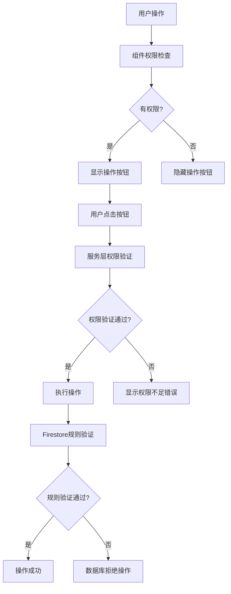

# 统一户口资料权限验证实现指南

## 🎯 实现目标

将账单付款申请系统的权限验证从基于 Firebase 令牌的 `role` 字段改为统一使用户口资料权限验证，确保权限逻辑的一致性和准确性。

## 📋 实现内容

### 1. 修改服务层权限验证

**文件：** `src/services/financeService.ts`

**修改内容：**
- 导入 `permissionService`
- 将所有权限验证方法改为使用 `permissionService.checkPermission()`
- 移除对 Firebase 令牌 `role` 字段的直接检查

**修改的方法：**
- `deleteRequest()` - 使用 `finance.delete` 权限
- `approveRequest()` - 使用 `finance.update` 权限
- `rejectRequest()` - 使用 `finance.update` 权限
- `payRequest()` - 使用 `finance.update` 权限

### 2. 创建权限同步服务

**文件：** `src/services/permissionSyncService.ts`

**功能：**
- 根据户口资料计算应该的 Firebase 角色
- 同步用户权限到 Firebase 令牌
- 检查权限同步状态
- 批量同步多个用户权限

### 3. 创建权限检查 Hook

**文件：** `src/hooks/useBillPaymentPermissions.ts`

**功能：**
- 提供账单付款申请相关的权限检查
- 支持单个权限检查
- 自动处理权限状态更新

### 4. 更新组件权限检查

**文件：** `src/components/BillPaymentSystem.tsx`

**修改内容：**
- 导入 `useBillPaymentPermissions` Hook
- 更新操作按钮的权限检查逻辑
- 根据权限动态显示/隐藏按钮

### 5. 更新 Firestore 规则

**文件：** `firestore.rules`

**修改内容：**
- 保持基于令牌的验证作为最后防线
- 添加注释说明实际权限验证在服务层进行

## 🔧 权限映射关系

### 户口资料字段 → 权限

| 户口资料字段 | 权限 | 说明 |
|-------------|------|------|
| `accountType: 'developer'` | `finance.delete`, `finance.update` | 开发者拥有完整财务权限 |
| `accountType: 'admin'` | `finance.delete`, `finance.update` | 管理员拥有完整财务权限 |
| `jciPosition: 'treasurer'` | `finance.update` | 财务长拥有财务更新权限 |
| `accountType: 'treasurer'` | `finance.update` | 财务长账户类型拥有财务更新权限 |

### 操作 → 权限要求

| 操作 | 权限要求 | 说明 |
|------|----------|------|
| 创建申请 | `finance.create` | 创建账单付款申请 |
| 编辑申请 | `finance.update` | 编辑待审批申请 |
| 审批申请 | `finance.update` | 审批通过申请 |
| 拒绝申请 | `finance.update` | 拒绝申请 |
| 确认支付 | `finance.update` | 确认支付完成 |
| 删除申请 | `finance.delete` | 删除申请记录 |

## 🚀 使用方法

### 1. 在组件中使用权限检查

```typescript
import { useBillPaymentPermissions } from '@/hooks/useBillPaymentPermissions';

const MyComponent = () => {
  const permissions = useBillPaymentPermissions();
  
  return (
    <div>
      {permissions.canCreate && (
        <Button onClick={handleCreate}>新建申请</Button>
      )}
      {permissions.canApprove && (
        <Button onClick={handleApprove}>审批</Button>
      )}
    </div>
  );
};
```

### 2. 检查单个权限

```typescript
import { useBillPaymentPermission } from '@/hooks/useBillPaymentPermissions';

const MyComponent = () => {
  const canDelete = useBillPaymentPermission('finance.delete');
  
  return (
    <div>
      {canDelete && (
        <Button danger onClick={handleDelete}>删除</Button>
      )}
    </div>
  );
};
```

### 3. 同步用户权限

```typescript
import { permissionSyncService } from '@/services/permissionSyncService';

// 同步单个用户权限
const result = await permissionSyncService.syncUserPermissions(userId);

// 检查权限同步状态
const status = await permissionSyncService.checkPermissionSyncStatus(userId);
```

## ⚠️ 注意事项

### 1. 权限同步

- Firebase 令牌中的 `role` 字段需要与户口资料保持同步
- 当户口资料更新时，需要同步更新 Firebase 令牌
- 建议在户口资料更新时自动触发权限同步

### 2. 性能考虑

- 权限检查会查询户口资料，可能有网络延迟
- 建议在组件中使用缓存机制
- 考虑使用 React Query 或 SWR 进行权限状态管理

### 3. 错误处理

- 权限检查失败时应该有适当的降级策略
- 建议显示用户友好的错误信息
- 记录权限检查失败的情况用于调试

## 🔍 测试建议

### 1. 权限测试

```typescript
// 测试不同角色的权限
const testPermissions = async () => {
  const developerPermissions = await permissionService.checkPermission('developer-user-id', 'finance.delete');
  const adminPermissions = await permissionService.checkPermission('admin-user-id', 'finance.delete');
  const treasurerPermissions = await permissionService.checkPermission('treasurer-user-id', 'finance.update');
  
  console.log('Developer can delete:', developerPermissions);
  console.log('Admin can delete:', adminPermissions);
  console.log('Treasurer can update:', treasurerPermissions);
};
```

### 2. 组件测试

```typescript
// 测试组件权限显示
const testComponentPermissions = () => {
  // 模拟不同权限状态
  const mockPermissions = {
    canCreate: true,
    canApprove: false,
    canDelete: true,
    loading: false
  };
  
  // 验证按钮显示/隐藏
  // ...
};
```

## 📊 权限验证流程



## 🎉 实现效果

1. **权限一致性**：所有权限验证都基于户口资料，确保逻辑一致
2. **灵活性**：支持基于职位和会员类别的权限增强
3. **可维护性**：权限逻辑集中管理，易于维护和扩展
4. **用户体验**：根据权限动态显示操作按钮，提供更好的用户体验
5. **安全性**：多层权限验证，确保操作安全

## 🔮 后续优化

1. **权限缓存**：实现权限状态缓存，提高性能
2. **实时同步**：实现权限变更的实时同步机制
3. **权限审计**：添加权限操作的审计日志
4. **批量操作**：支持批量权限更新和同步
5. **权限模板**：创建权限模板，简化权限配置
