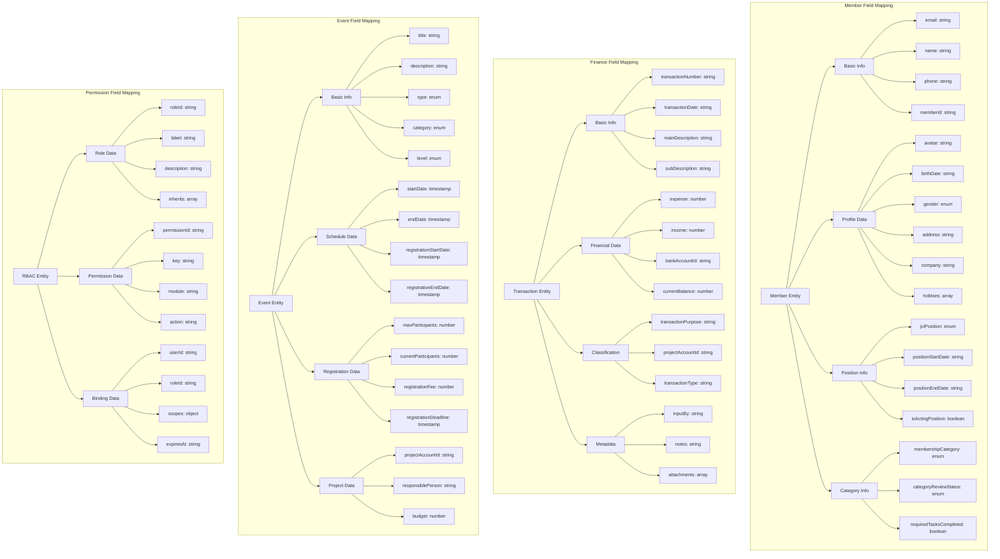
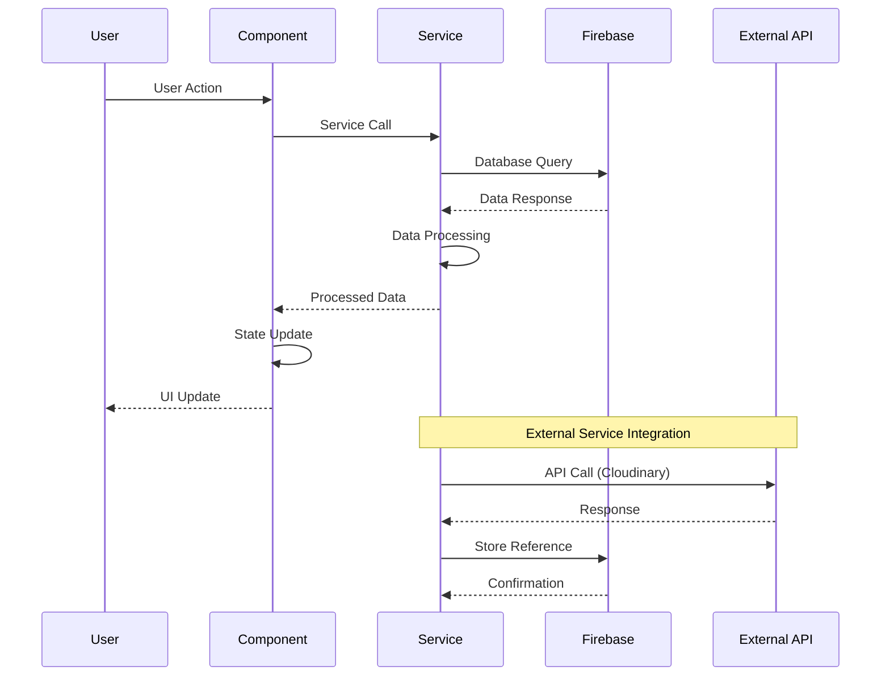
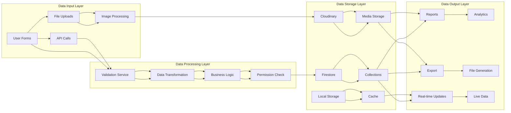

```mermaid
graph TB
    subgraph "Frontend Layer"
        A[React App] --> B[Ant Design UI]
        A --> C[React Router]
        A --> D[Zustand Store]
        A --> E[React Query]
    end
    
    subgraph "Application Layer"
        F[App.tsx] --> G[Layout Components]
        F --> H[Page Components]
        F --> I[Module Components]
        
        G --> G1[AppHeader]
        G --> G2[AppSider]
        G --> G3[MainContent]
        
        H --> H1[DashboardPage]
        H --> H2[LoginPage]
        H --> H3[RegisterPage]
        
        I --> I1[Member Module]
        I --> I2[Finance Module]
        I --> I3[Event Module]
        I --> I4[Permission Module]
        I --> I5[Award Module]
        I --> I6[Survey Module]
        I --> I7[Image Module]
        I --> I8[System Module]
    end
    
    subgraph "Service Layer"
        J[Auth Service] --> K[Firebase Auth]
        L[Member Service] --> M[Firestore]
        N[Finance Service] --> M
        O[Event Service] --> M
        P[Permission Service] --> M
        Q[Image Service] --> R[Cloudinary]
    end
    
    subgraph "Configuration Layer"
        S[Global Collections] --> T[Firebase Collections]
        U[Global Settings] --> V[System Config]
        W[Global Permissions] --> X[RBAC System]
        Y[Global Validation] --> Z[Form Validation]
    end
    
    subgraph "External Services"
        AA[Firebase] --> BB[Firestore Database]
        AA --> CC[Firebase Auth]
        AA --> DD[Firebase Storage]
        EE[Cloudinary] --> FF[Image Storage]
        GG[Netlify] --> HH[Deployment]
    end
    
    A --> F
    F --> J
    F --> L
    F --> N
    F --> O
    F --> P
    F --> Q
    
    J --> AA
    L --> AA
    N --> AA
    O --> AA
    P --> AA
    Q --> EE
    
    S --> AA
    U --> AA
    W --> AA
    Y --> AA
```

```mermaid
graph TB
    subgraph "Core Modules"
        A[Member Module] --> A1[MemberService]
        A --> A2[MemberStore]
        A --> A3[Member Components]
        A --> A4[Member Types]
        
        B[Finance Module] --> B1[FinanceService]
        B --> B2[TransactionService]
        B --> B3[BudgetService]
        B --> B4[Finance Components]
        B --> B5[Finance Types]
        
        C[Event Module] --> C1[EventService]
        C --> C2[EventRegistrationService]
        C --> C3[Event Components]
        C --> C4[Event Types]
        
        D[Permission Module] --> D1[PermissionService]
        D --> D2[RBACService]
        D --> D3[Permission Components]
        D --> D4[Permission Types]
    end
    
    subgraph "Supporting Modules"
        E[Award Module] --> E1[AwardService]
        E --> E2[Award Components]
        E --> E3[Award Types]
        
        F[Survey Module] --> F1[SurveyService]
        F --> F2[Survey Components]
        F --> F3[Survey Types]
        
        G[Image Module] --> G1[ImageService]
        G --> G2[UploadService]
        G --> G3[Image Components]
        G --> G4[Image Types]
        
        H[System Module] --> H1[SystemService]
        H --> H2[SettingsService]
        H --> H3[System Components]
        H --> H4[System Types]
    end
    
    subgraph "Shared Services"
        I[AuthService] --> J[Firebase Auth]
        K[FirebaseService] --> L[Firestore]
        M[GlobalConfig] --> N[System Settings]
        O[ValidationService] --> P[Form Validation]
    end
    
    A1 --> K
    B1 --> K
    C1 --> K
    D1 --> K
    E1 --> K
    F1 --> K
    G1 --> K
    H1 --> K
    
    A --> I
    B --> I
    C --> I
    D --> I
    E --> I
    F --> I
    G --> I
    H --> I
```

```mermaid
erDiagram
    MEMBER ||--o{ MEMBER_PROFILE : has
    MEMBER ||--o{ MEMBER_POSITION : holds
    MEMBER ||--o{ MEMBER_CATEGORY : belongs_to
    MEMBER ||--o{ EVENT_REGISTRATION : registers_for
    MEMBER ||--o{ TRANSACTION : creates
    MEMBER ||--o{ BILL_PAYMENT : makes
    
    EVENT ||--o{ EVENT_PROGRAM : contains
    EVENT ||--o{ EVENT_COMMITTEE : has_committee
    EVENT ||--o{ EVENT_TRAINER : has_trainers
    EVENT ||--o{ EVENT_TICKET : offers_tickets
    EVENT ||--o{ EVENT_REGISTRATION : receives_registrations
    EVENT ||--|| PROJECT_ACCOUNT : linked_to
    
    TRANSACTION ||--|| BANK_ACCOUNT : uses
    TRANSACTION ||--o{ TRANSACTION_SPLIT : can_be_split
    TRANSACTION ||--|| TRANSACTION_PURPOSE : categorized_by
    
    BANK_ACCOUNT ||--o{ TRANSACTION : contains_transactions
    
    PROJECT_ACCOUNT ||--o{ TRANSACTION : receives_transactions
    PROJECT_ACCOUNT ||--o{ BUDGET : has_budget
    
    SURVEY ||--o{ SURVEY_QUESTION : contains
    SURVEY ||--o{ SURVEY_RESPONSE : receives_responses
    SURVEY_QUESTION ||--o{ SURVEY_ANSWER : has_answers
    
    AWARD ||--o{ AWARD_SUBMISSION : receives_submissions
    AWARD ||--o{ AWARD_CATEGORY : belongs_to
    
    RBAC_ROLE ||--o{ RBAC_PERMISSION : grants
    RBAC_ROLE_BINDING ||--|| MEMBER : binds_to
    RBAC_ROLE_BINDING ||--|| RBAC_ROLE : binds_role
    
    CHAPTER_SETTINGS ||--o{ MEMBER : manages
    WORLD_REGION ||--o{ COUNTRY : contains
    COUNTRY ||--o{ NATIONAL_REGION : contains
    NATIONAL_REGION ||--o{ LOCAL_CHAPTER : contains
```

# JCI KL Membership App - 架构图表集合

## 📊 PHASE 1: 系统整体架构图

## 📊 PHASE 2: 模块化架构详细图

## 📊 PHASE 3: 数据模型关系图

## 📊 PHASE 4: 组件层次结构图

```mermaid
graph TB
    subgraph "Layout Components"
        A[App.tsx] --> B[SidebarProvider]
        A --> C[Layout]
        
        C --> D[AppSider]
        C --> E[AppHeader]
        C --> F[MainContent]
        
        D --> D1[Navigation Menu]
        D --> D2[Chapter Logo]
        D --> D3[Collapse Toggle]
        
        E --> E1[User Avatar]
        E --> E2[User Menu]
        E --> E3[Chapter Title]
        
        F --> F1[Page Router]
        F --> F2[Content Area]
    end
    
    subgraph "Page Components"
        G[DashboardPage] --> G1[Statistics Cards]
        G --> G2[Recent Activities]
        G --> G3[Quick Actions]
        
        H[MemberListPage] --> H1[Member Table]
        H --> H2[Search Filters]
        H --> H3[Batch Actions]
        
        I[FinancePage] --> I1[Transaction Table]
        I --> I2[Budget Overview]
        I --> I3[Reports Generator]
        
        J[EventManagementPage] --> J1[Event List]
        J --> J2[Event Calendar]
        J --> J3[Registration Management]
    end
    
    subgraph "Module Components"
        K[Member Components] --> K1[MemberForm]
        K --> K2[MemberCard]
        K --> K3[MemberProfile]
        
        L[Finance Components] --> L1[TransactionForm]
        L --> L2[BudgetModal]
        L --> L3[FinancialReports]
        
        M[Event Components] --> M1[EventForm]
        M --> M2[EventCard]
        M --> M3[RegistrationForm]
        
        N[Permission Components] --> N1[PermissionMatrix]
        N --> N2[RoleSelector]
        N --> N3[AccessControl]
    end
    
    subgraph "Common Components"
        O[Common Components] --> O1[LoadingSpinner]
        O --> O2[StandardEditModal]
        O --> O3[ResponsiblePersonSelector]
        O --> O4[TeamManagementModal]
        O --> O5[IndicatorCard]
    end
    
    F1 --> G
    F1 --> H
    F1 --> I
    F1 --> J
    
    G --> K
    H --> K
    I --> L
    J --> M
    
    K --> O
    L --> O
    M --> O
    N --> O
```

## 📊 PHASE 5: 字段映射关系图

## 📊 PHASE 6: 服务层交互图

## 📊 PHASE 7: 数据流架构图

## 🎯 使用说明

1. **在线查看**: 将代码复制到 [Mermaid Live Editor](https://mermaid.live/) 查看
2. **VS Code**: 安装Mermaid插件，在Markdown文件中预览
3. **导出图片**: 使用在线编辑器导出PNG/SVG/PDF格式
4. **集成文档**: 将代码集成到项目文档中

## 📋 架构总结

- **技术栈**: React + TypeScript + Firebase + Ant Design
- **架构模式**: 模块化分层架构
- **数据管理**: Firebase + Cloudinary + 状态管理
- **权限控制**: RBAC权限管理系统
- **部署方式**: Netlify + Vite构建
